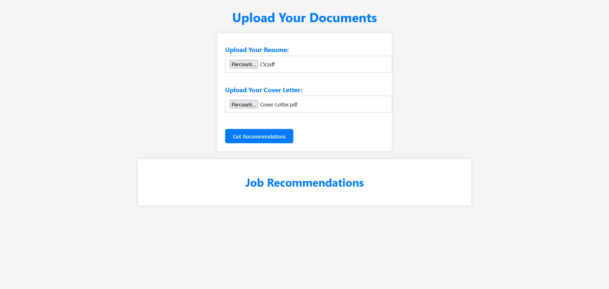
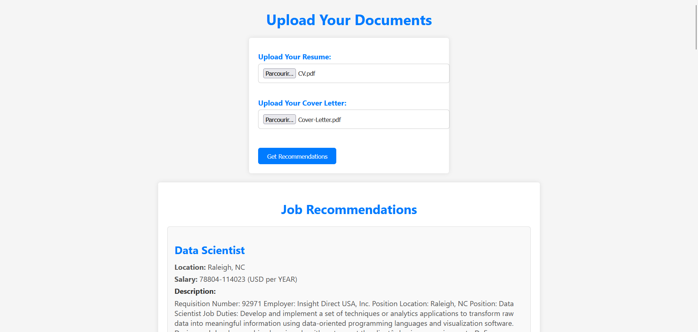
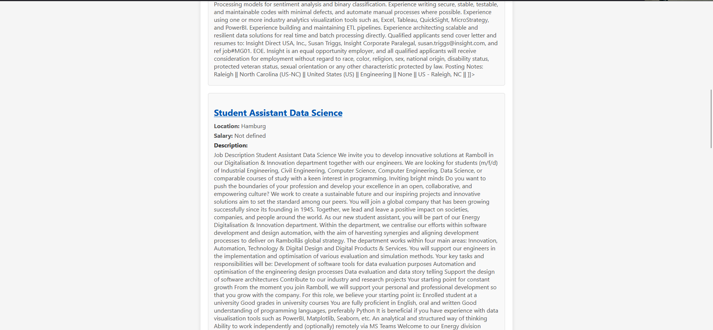

# Job-Recommandation
This repository is about an end-to-end project in Data Science about Job Recommandation
Recommendation Application

This is a FastAPI-based application that provides job recommendations based on the content of a user's resume. It uses OpenAI's text embeddings to find the most similar job postings from a dataset.


Installation
```
git clone https://github.com/achraflouzali/Job-Recommandation
cd Job-Recommandation
pip install -r requirements.txt
```
The job offers came from a  [Kaggle Dataset](https://www.kaggle.com/datasets/techmap/us-job-postings-from-2023-05-05) that was cleaned using notebooks/clean_data.ipynb 


# How It Works

The application works by:

    Text Embedding: It uses OpenAI's text embeddings to convert the resume and, optionally, the cover letter, into numerical vectors. In order to do that you should use an openai key 

    Cosine Similarity: It calculates the cosine similarity between the embeddings of your resume and the job postings in the dataset to find the most similar jobs.

    Recommendations: It provides a list of recommended jobs, including the job title, company, location, job description, salary, and URL.

File Uploads

    Resume: You must upload your resume in PDF format. The application will extract text from the PDF to analyze.

    Cover Letter (optional): You can also upload a cover letter in PDF format if you have one. The cover letter will be combined with your resume for analysis.

Result

After clicking the "Get Recommendations" button, you will see a list of recommended jobs based on your resume and, if provided, your cover letter. Each recommendation includes the following information:

    Job Title: The title of the recommended job.
    Company: The company offering the job.
    Located in: The location of the job.
    Job Description: A  description of the job.
    Salary: The salary for the job.





Running the Application

To run the application, execute the following command from the project directory:


```
python app.py
```
This will start the FastAPI application, and you can access it in your web browser at http://localhost:8000.
Contributing

If you would like to contribute to this project, please open an issue or submit a pull request on the GitHub repository.
